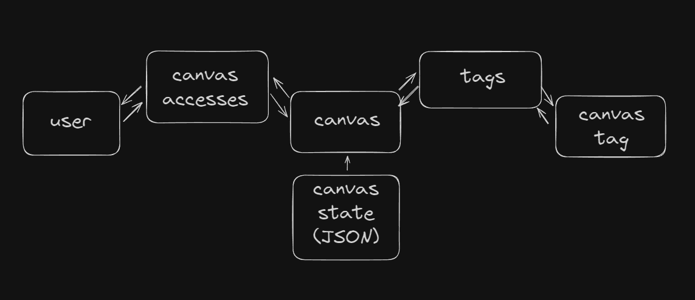

# Excalistudio - Api service

## Description
Excalistudio Backend Service is a custom backend solution for the open-source [Excalidraw editor](https://www.npmjs.com/package/@excalidraw/excalidraw). We have also developed a [frontend wrapper](https://github.com/Excali-Studio/excali-front-wrapper), which is available here. If you think our project is worth noting, please consider leaving a star or contributing to its development.

### How to start local environment?

```bash
# 1. Clone repository
$ git clone https://github.com/Excali-Studio/excali-front-wrapper

# 2. Install dependencies
$ pnpm install

# 3. Create and configure .env file 

# 4. Seed database (at your own, read below)
```

__If you want to run full application, check last section!__

___IMPORTANT!___: One of the most important settings is `AUTH_EMAIL_DOMAIN_WHITELIST`. You need to configure it for your domain. Also, don’t forget to provide your database credentials.

_Default DB config:_
* DB type: `postgres`
* host: `localhost`
* name: `excali_studio`
* username: `excali_studio`
* password: `excali_studio`

### Seed database

Here’s a revised version of your text for better clarity and grammar:

We handle certain cases using roles and tags; however, you need to set these up manually. Currently, there is no script for this, so you’ll need to insert them using a database viewer or console.

__Roles__: `ADMIN`, `USER`

__Tags__: `SHARED`

### Build-in commands
```bash
# For development
$ pnpm run start

# For local development, watch mode
$ pnpm run start:dev

# For production
$ pnpm run start:prod

### TESTS

# unit tests
$ pnpm run test

# e2e tests
$ pnpm run test:e2e

# test coverage
$ pnpm run test:cov
```

### Auth in application
Our authentication is based on Passport.js. Currently, we have configured Google authentication, but feel free to add other providers and contribute.
1. `/api/auth/google/login` - redirects to google auth
2. `/api/auth/status` - returns auth status
3. `/api/user/me` - returns session data


### Swagger docs
We also provide Swagger documentation to make integration with your project easier.
Available at: `/api`

### Core database schema


### Learn more
If you want setup full application, check out
- [frontend editor wrapper](https://github.com/Excali-Studio/excali-front-wrapper) for ready to use frontend
- [excali room](https://github.com/Excali-Studio/excalidraw-room) for live collaboration feature

All three applications are needed for excalistudio to work properly